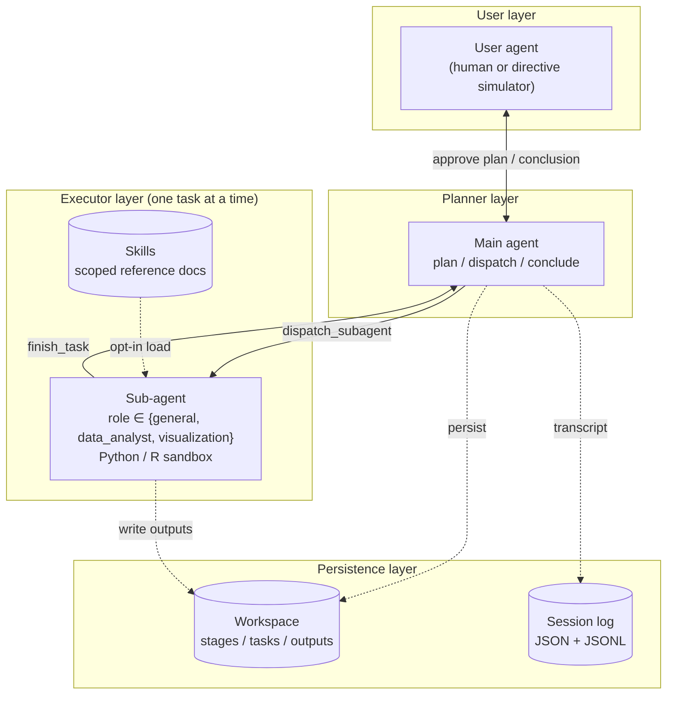

<div align="center">

# BioCodex

**An agent harness for stage-by-stage scientific investigation, with a human or simulated PI in the loop**

A planner LLM coordinates code-executing sub-agents in a sandboxed Python / R workspace,
gated by a user agent (human or simulated principal investigator), to drive each research
stage forward.

<p>
<a href="https://www.python.org/"></a>
<a href="https://www.r-project.org/"></a>
<a href="https://github.com/BerriAI/litellm"></a>
<a href="https://docs.pydantic.dev/"></a>
<a href="https://streamlit.io/"></a>


</p>

</div>

---

## Overview

BioCodex is a multi-agent harness designed to **assist researchers** through stage-by-stage
scientific investigation: exploratory analysis, method choice, code execution, and
iterative interpretation — with a human or simulated principal investigator in the loop.
End-to-end reproduction of peer-reviewed biology papers is used to **validate** the
harness; the validation is conducted in an undergraduate thesis project (Peking University
School of Life Sciences, 2026).

The design separates **planning** from **execution** and inserts a configurable
**user-in-the-loop** between them. The user agent can be a human or an LLM that follows a
directive script derived from the research brief, so it pushes back on premature
conclusions instead of rubber-stamping.

## System architecture



Stages are independent units of work (plan + tasks + conclusion). The user drives
direction; the agent does not auto-advance after a conclusion. Sub-agent dispatches
execute sequentially: the main agent invokes `dispatch_subagent`, waits for
`finish_task`, then issues the next call.

## Highlights

<table>
<tr>
<td width="50%">

### Planner / executor split
The main agent never invokes `run_code`. Sub-agents receive one task each, execute in an
isolated working directory, and return a single structured result via `finish_task`.

</td>
<td width="50%">

### Sandboxed Python + R runtime
Curated package set probed at startup. Optional R is auto-detected; if `Rscript` is
absent, `language="r"` is structurally rejected at the tool boundary, not by prompt.

</td>
</tr>
<tr>
<td>

### Directive simulated user
The simulated PI follows behavioral directives derived from the research brief: approves
goal-aligned plans, pushes back on premature claims, signals approval unambiguously.

</td>
<td>

### Crash-safe persistence
Every stage's plan, per-task transcripts and outputs, and final conclusion live as
inspectable files. Sessions are saved on uncaught exceptions; `harness.resume()`
continues from the last good state.

</td>
</tr>
<tr>
<td>

### Skill system
Sub-agents opt into scoped reference docs (database APIs, statistics, visualization) per
task. Reference content stays out of the global system prompt.

</td>
<td>

### Streamlit viewer
Step through a session's agent ↔ tool transcript and per-stage artifacts. Useful for
post-hoc evaluation and for debugging unexpected agent behavior.

</td>
</tr>
</table>

## Validation: reproduced workflows

End-to-end reproduction of peer-reviewed papers is the primary validation target for the
harness. Each run is scored against the published methods and conclusions.

| Paper | Domain | Methods exercised | Runtime |
|---|---|---|---|
| **PhageCounting** &nbsp;<sub>Nat Commun 15 (2024)</sub> | phage growth modeling | OD calibration → Monod fit → coupled ODE inference | Python |
| **CRC survival** &nbsp;<sub>Sci Rep 13 (2023)</sub> | survival classification | χ² selection → NaiveBayes / RF / gradient boosting → ROC / AUC | Python |
| **Lyme diagnostics** &nbsp;<sub>Nat Commun 16 (2025)</sub> | proteomics ML | nested cross-validation, RFECV, multi-classifier ensemble | Python |
| **insilico_immunotherapy** | tumor–immune dynamics | TumorImmuneModels (R / Rcpp) | R |
| **Kaggle Pan-Cancer** | gene expression | PCA + sklearn classification (smoke test) | Python |

Each scenario in `scenarios/` specifies a research brief, a data catalog, and an
evaluation checklist used to score the run.

## Quick start

```bash
git clone https://github.com/JiaruiSun526/bio-research-harness.git
cd bio-research-harness
pip install -e .[viewer,dev]
cp config/llm.toml.example config/llm.toml   # fill in provider URLs and keys
```

Run the offline test suite (no LLM calls):

```bash
python -m pytest tests/ -v --ignore=tests/test_smoke_api.py
```

Run a scenario end-to-end with a directive simulated PI:

```bash
python scripts/run_validation.py scenarios/phagecounting.toml \
    --provider openrouter --user-provider mimo
```

Inspect a saved session:

```bash
streamlit run src/research_agent/viewer.py -- runs/<session>/session.json
```

## Project layout

<details>
<summary><b>src / research_agent</b> — core package</summary>

```
harness.py          session orchestration + resume
loop.py             main-agent tool-use loop
tool_registry.py    tool dispatch and per-tool result handling
tools.py            dispatch_subagent, save_plan, run_code, finish_task, ...
workspace.py        filesystem layout for stages / tasks / outputs
context.py          message construction, truncation, refresh
llm_client.py       litellm wrapper with retries + token tracking
runtime_env.py      Python / R package probing + execution sandbox
prompts.py          system prompts (main / sub / user)
schemas.py          pydantic models for plans, tasks, results
session_log.py      JSON snapshot + JSONL transcript
user_agent/         human + simulated implementations
viewer.py           streamlit session viewer
```

</details>

<details>
<summary><b>scenarios</b> — reproduction targets</summary>

Each scenario is a TOML file pairing a research brief, a data catalog, and an evaluation
checklist. New scenarios can be authored by hand or generated with
`scripts/prepare_scenario.py`.

</details>

<details>
<summary><b>skills</b> — sub-agent reference docs</summary>

Curated, scoped documentation that sub-agents can opt into per task: database APIs
(GEO, ENA, ClinVar, KEGG, ...), statistical methods (DESeq2, pydeseq2, GSEA), and
visualization (matplotlib, plotly, networkx). Loaded on demand, not in the global system
prompt.

</details>

<details>
<summary><b>scripts</b> — entry-point runners</summary>

```
prepare_scenario.py   generate a scenario from a paper
run_validation.py     execute one scenario end-to-end
run_scenario_live.py  interactive single-session runner with a human user
run_batch.{py,sh}     batched scenario execution
evaluate_run.py       score a finished run against its checklist
generate_checklist.py extract an evaluation checklist from a paper
summarize_runs.py     aggregate metrics across runs
```

</details>

## Status

Active research code from a graduation thesis. Interfaces are stable enough for
end-to-end runs but expect rough edges. Issues and discussion welcome.

## Citation

```bibtex
@misc{biocodex,
  author = {Sun, Jiarui},
  title  = {BioCodex: an agent harness for stage-by-stage scientific investigation},
  year   = {2026},
  url    = {https://github.com/JiaruiSun526/bio-research-harness}
}
```

## License

License terms are pending. Please open an issue before redistributing.
